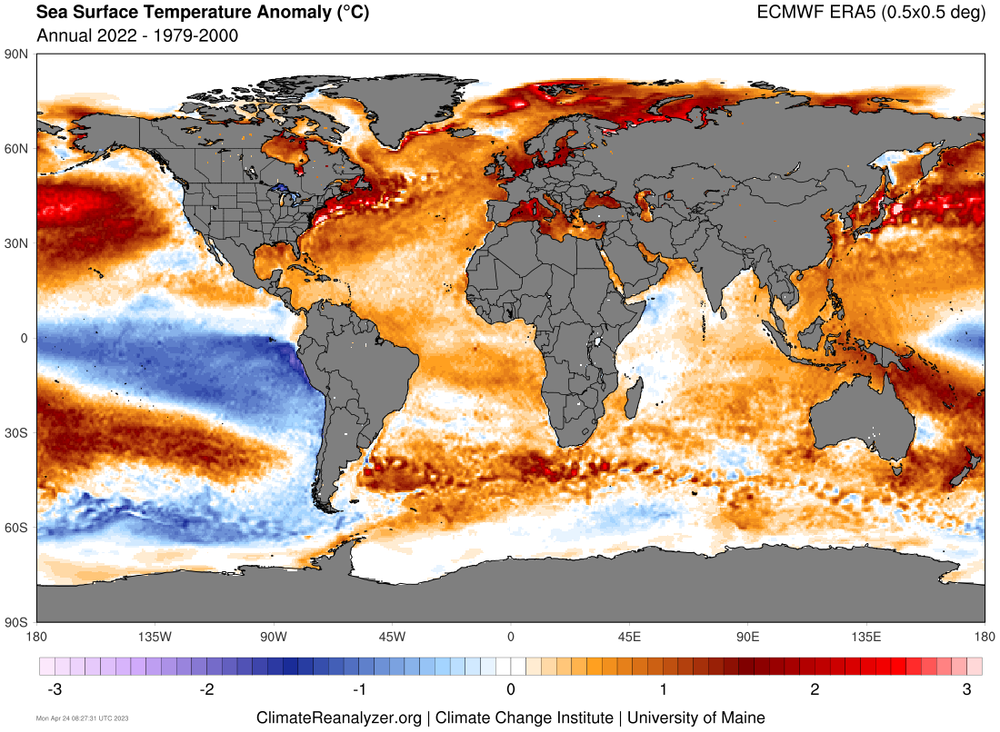

# TFM
In this repository the notebooks and other relevant information of my end of master project will be uploaded. The following link drives you through a video that I made, where a brief explanation of the notebook ('compacto_SST_SON_slp_DJF_video.ipynb') is given: https://www.loom.com/share/7e211f9d755f48e89e4f63b2f4076b84.

Increasingly, the main model is the one called 'compacto_SST_SON_slp_DJF.ipynb', which is made in a form that makes it available to modify the hyperparameters of the model from an external file, called 'hyperparameters'. On it, the input and output regions can be modified, as well as other parameters such as the months of the predictor and predictand, the time period, the model characteristics...

